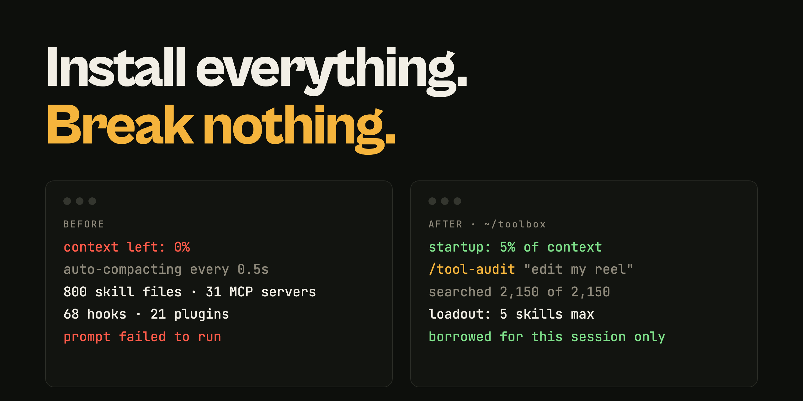
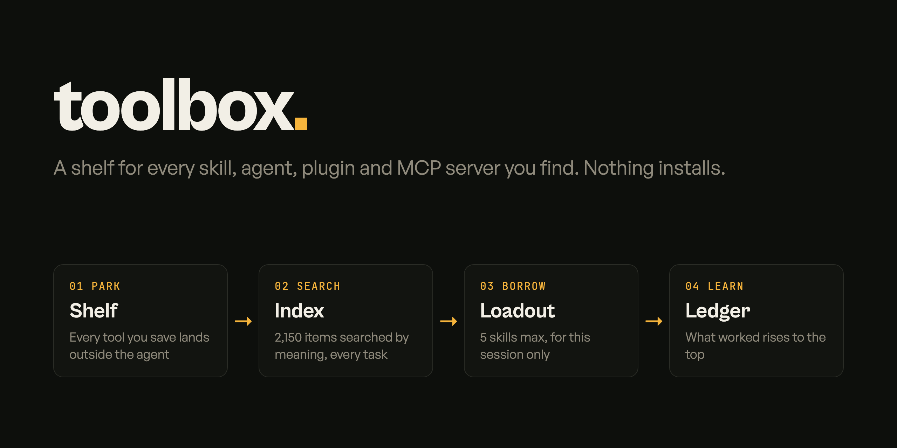
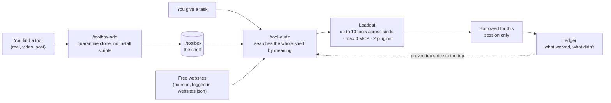

<p align="center">
  
</p>

<h1 align="center">toolbox</h1>

<p align="center">
  <b>Download every AI tool you find. Break nothing.</b><br>
  A shelf for skills, agents, plugins, MCP servers and free web tools. Your coding agent borrows only what each task needs.
</p>

<p align="center">
  
  
  
  
</p>

<p align="center">
  <a href="#quick-start">Quick start</a> ·
  <a href="#how-it-works">How it works</a> ·
  <a href="docs/SETUP.md">Setup guide for your agent</a> ·
  <a href="#credits">Credits</a>
</p>

## Quick start

Tell your coding agent:

```
Clone https://github.com/nonstopmatt/agent-toolbox to ~/toolbox, read docs/SETUP.md, and set it up for me.
```

Or do it yourself:

```bash
git clone https://github.com/nonstopmatt/agent-toolbox ~/toolbox
~/toolbox/bin/bootstrap.sh
```

Then, in Claude Code:

```
/tool-audit edit a vertical video with motion graphics
/toolbox-add https://github.com/<someone>/<some-repo-from-a-reel>
```

Needs: git, Python 3, and [Ollama](https://ollama.com) for the free local search (it falls back to keyword search without it).

## How it works

<p align="center"></p>



| Before | After |
|---|---|
| 800 skill files, 31 MCP servers, 68 hooks, 21 plugins, all loaded every session | Everything parked on a shelf, nothing loaded until a task needs it |
| Context at 0%, auto-compacting every half second | Startup at 5% of context |
| 285 agent descriptions over Claude Code's own limit | Agents cost 300 tokens |
| A new tool goes straight into the live config | A new tool is cloned into quarantine and fact-checked first |

---

## The story

I'm not an engineer. I build through coding agents. One night I binged Instagram videos about which skills, plugins, MCP servers and connectors to install to turn Claude Code into the ultimate technical cofounder, and the next day I installed all of it, in a lot of terminals at once. I actually told an AI, "I have great confidence that all the tools I installed will be able to work together." They did not.

## What broke

It started with a 503 on a loop. Then my context went from 100% to 0% instantly and Claude Code auto-compacted every half second. I couldn't run a single prompt, including the one asking it to fix itself. One tool took over a session and started redoing work I'd already finished.

I never got a `/context` screenshot of the broken state, because Claude Code couldn't stay up long enough. What the repair found:

- The plain `claude` command was aliased through a local router. That capped context at 128k while my settings asked for 1M, and going through the proxy switched off on-demand MCP tool loading, so every tool definition loaded in full, every session.
- 285 agents whose descriptions alone were about 16k tokens, over Claude Code's own 15k limit. It had been warning me the whole time.
- A memory plugin injecting about 24.8k tokens at the start of every session and after every compaction. Its last line said "continue work on CRM deployment," which is why sessions kept redoing finished work.
- A compaction plugin I had already disabled left a block in my CLAUDE.md that forced every compaction to produce one useless sentence. Start too full, compact, get an empty summary, the memory plugin refills it, compact again. That was the half-second loop.
- 68 hooks, 800 skill files (1.2 GB), 21 plugins, 31 MCP servers, an 8.4 GB config folder, and `git push` pre-approved in auto mode.
- My self-improvement skill was 26% of my usage. I was paying a quarter of my week to be observed.

## How it got fixed

Startup is now 46.9k tokens out of 1M, 5% used. Agents went from 16k tokens to 300. 394 MCP tools cost 640 tokens, because tools load on demand again. Hooks went from 68 to 8. Skills went from 376 to 97. The skills line still reads 10k tokens, because 10k is the ceiling Claude Code sets for the skill listing. The difference is that 97 full descriptions now fit under it, where 376 were being cut down to stubs the agent couldn't match on. No tokens saved there, just skills that work.

The lesson: these tools don't cooperate, they stack. Every one adds text to every prompt whether you use it or not. The fix wasn't fewer tools. It was getting them out of the agent's head and onto a shelf.

## What this repo is

The shelf, and the system for using it.

- `bin/library.py` sweeps the **whole** library (about 2,150 items on my machine: skills, plugin skills, agents, MCP servers, connectors, design systems, notes about local tools, credential names) into one local index, then searches it by meaning with a local embedding model. Every audit starts with it and reports `COVERAGE searched N of N`, so a thin search is visible.
- `capabilities.md` lists every job and every tool that can do it, in the order to try them. When one fails (paywall, spend cap, signed out, broken), the audit moves to the next instead of giving up.
- `TOOLS-MEMORY.md` is the category index plus the Proven list. `catalog/` splits everything by job.
- `websites.json` is a knowledge base of free web apps that have no repo (image tools, converters, schedulers with free APIs). A lot of jobs are one upload on the right website, so the audit searches these alongside everything else. `catalog/websites.md` is generated from it.
- `my-skills/tool-audit` sweeps everything, shortlists with a subagent, then picks a loadout of up to 10 tools across at least three kinds, with a backup for every slot, borrows agents and skills by reading their files instead of installing them, launches MCP servers for one session only, and records how it went in a ledger.
- `my-skills/toolbox-add` adds a repo without installing it: shallow clone into quarantine, no install scripts, no live-config writes, then it updates the manifest and the index. A tool that is only a website goes into `websites.json` instead, with its free tier fact-checked and nothing signed up for.
- `my-skills/skill-audit` and `my-skills/self-improvement-report` are smaller helpers.
- `manifest.json` records every upstream with its URL, license and pinned commit. `bin/bootstrap.sh` rebuilds everything the manifest tracks on a new machine. `bin/sync.sh` rebuilds the catalog, scans for secrets and pushes.
- `docs/SETUP.md` explains the system to your coding agent, if you want to adopt it.

Most of what the catalog lists is other people's work that I found and organized. None of their code is in this repo, only links back to them. The part I built is the system for using a lot of it without breaking your agent.

The toolbox on my machine also holds skills from packs whose origin I didn't record. Those aren't in this repo, and `bin/bootstrap.sh` rebuilds only what `manifest.json` tracks, so a toolbox rebuilt from this repo will be smaller than mine.

The catalog here also leaves out a few entries on purpose: skills whose license reserves all rights, which I keep on my machine but don't list publicly.

## What I changed after the first version

The first version of the audit read one to three catalog files and matched keywords. It looked at about 2% of the library and quietly fell back to default habits whenever its first pick hit a paywall or a spend cap. Now it searches everything, every time, by meaning; tools you name can't be dropped; every pick has a backup; and account problems are logged separately so a paywalled tool isn't marked as bad.

## Credits

The upstream repos in `manifest.json`, with thanks to the people who made them:

- [public-apis/public-apis](https://github.com/public-apis/public-apis) (MIT)
- [punkpeye/awesome-mcp-servers](https://github.com/punkpeye/awesome-mcp-servers) (MIT)
- [sindresorhus/awesome](https://github.com/sindresorhus/awesome) (CC0-1.0)
- [mnfst/awesome-free-llm-apis](https://github.com/mnfst/awesome-free-llm-apis) (CC0-1.0)
- [ripienaar/free-for-dev](https://github.com/ripienaar/free-for-dev) (linked only, no license file found)
- [ollama/ollama](https://github.com/ollama/ollama) (MIT)
- [nexu-io/open-design](https://github.com/nexu-io/open-design) (Apache-2.0)
- [D4Vinci/Scrapling](https://github.com/D4Vinci/Scrapling) (BSD-3-Clause)
- [OpenHands/OpenHands](https://github.com/OpenHands/OpenHands) (MIT, its enterprise/ folder may differ)
- [langflow-ai/langflow](https://github.com/langflow-ai/langflow) (MIT)
- [Shubhamsaboo/awesome-llm-apps](https://github.com/Shubhamsaboo/awesome-llm-apps) (Apache-2.0)
- [msitarzewski/agency-agents](https://github.com/msitarzewski/agency-agents) (MIT)
